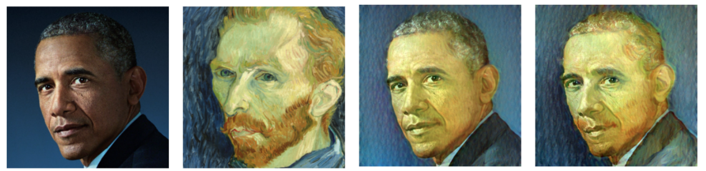
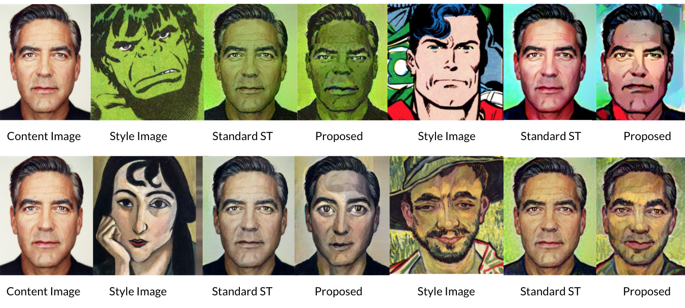

# Caricature Your Face

Using [The Face of Arts](https://faculty.idc.ac.il/arik/site/foa/face-of-art.asp) and [DST](https://sunniesuhyoung.github.io/DST-page/) to generate geometry-aware face caricatures.

## Requirements

- Python 3
- pytorch, torchvision, cudatoolkit, numpy, PIL, matplotlib, sklearn, cv2, imutils, scikit-image

Set up the virtual environment:

```
python3 -m venv venv
source venv/bin/activate
pip3 install -r requirements.txt
```

after setup, you can just run `source venv/bin/activate` to activate the `venv` later on.

## How To Run

`preprocessing.sh` is used to convert all Face of Art style images' correspondence points into `.txt`, this only need to be run once if you don't already have `data/style/pts` containing all Face of Art style images.

`run.sh` is a script automating the two steps for geometry style transfer.

Currently, `run.sh` serve as a demo with Barack Obama as the content image and 
Vincent van Gogh's self-portrait with the style image.

#### 1. Obtain Facial Landmark 
This step will obtain the facial landmarks for the content image with dlib.

```
python face_landmark_detection.py ${content_path} ${style_path} ${content_pts_path} ${style_pts_path_dlib}
```

#### 2. Run Style Transfer

Now, run deformable style transfer, this step will take ~1.5 minutes on a single GPU.

Please check parameter adjustment in DST repo [[code]](https://github.com/sunniesuhyoung/DST). 

```
python main.py ${content_path} ${style_path} ${content_pts_path} ${style_pts_path} \
  ${output_dir} ${output_prefix} ${im_size} ${max_iter} \
  ${checkpoint_iter} ${content_weight} ${warp_weight} ${reg_weight} ${optim} \
  ${lr} ${verbose} ${save_intermediate} ${save_extra} ${device}
```
## Results

#### Demo 
Result from `run.sh` with Barack Obama as the content image and 
Vincent van Gogh's self-portrait with the style image.

 

#### More Results

 


## Acknowledgment
- [Dilb](http://dlib.net/face_landmark_detection.py.html) facial landmark
- Deformable Style Transfer (DST) [[code]](https://github.com/sunniesuhyoung/DST) | [Paper](https://arxiv.org/abs/2003.11038)
- Style Transfer by Relaxed Optimal Transport and Self-Similarity. Nicholas Kolkin, Jason Salavon and Gregory Shakhnarovich. CVPR 2019. [[paper]](https://arxiv.org/abs/1904.12785) [[code]](https://github.com/nkolkin13/STROTSS) [[David Futschik's implementation]](https://github.com/futscdav/strotss)
- WarpGAN: Automatic Caricature Generation. Yichun Shi, Debayan Deb and Anil K. Jain. CVPR 2019. [[paper]](https://arxiv.org/abs/1811.10100) [[code]](https://github.com/seasonSH/WarpGAN)
- Neural Best-Buddies: Sparse Cross-Domain Correspondence. Kfir Aberman, Jing Liao, Mingyi Shi, Dani Lischinski, Baoquan Chen and Daniel Cohen-Or. SIGGRAPH 2018. [[paper]](https://arxiv.org/abs/1805.04140) [[code]](https://github.com/kfiraberman/neural_best_buddies)
